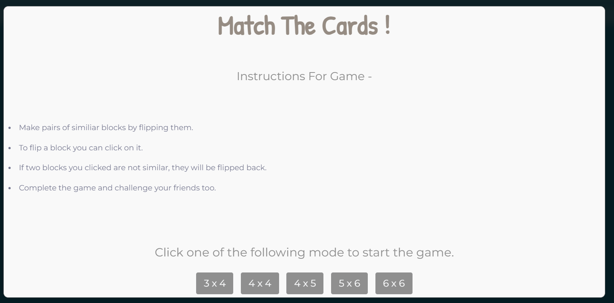
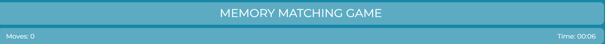
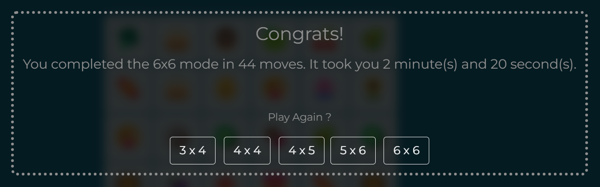
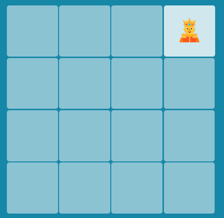
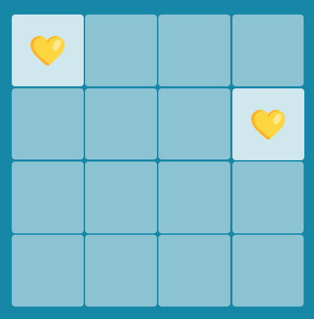

Memory Matching Game

Description:

The Memory Matching Game is a fun and interactive game where players flip cards to find matching pairs. The game includes different difficulty modes and keeps track of the number of moves and the time taken to complete the game.

Features:

Introduction- 
 
Multiple difficulty levels (3x4, 4x4, 4x5, 5x6, 6x6) 

 

Timer and move counter 
 

Simple and elegant UI using Bootstrap

Smooth animations and transitions 

Closure- 
 

Fully responsive design

Technologies Used:

HTML

CSS

JavaScript

Bootstrap

How to Play: 

Click on a card to flip it. 
 

Click on another card to find its matching pair. 
 

If the two cards match, they remain flipped.

If they don’t match, they flip back after a short delay.

Continue matching pairs until all pairs are found.

The game ends when all pairs are matched, and the total time and number of moves are displayed.

Installation & Setup:

Clone the repository:

git clone https://github.com/saivarun0007/Memory-Matching-Game.git

Navigate to the project directory:

cd Memory-Matching-Game

Open index.html in your browser.

File Structure:

/Memory-Matching-Game 
│── index.html        # Main HTML file 
│── style.css         # Styling file 
│── script.js         # JavaScript logic for the game 
│── favicon.avif      # Game icon 
│── README.md         # Project documentation 
└── LICENSE           # MIT License file 

Credits:

Developed by CHANDRUPATLA SAI VARUN

License:

This project is licensed under the MIT License. Feel free to use and modify it!
